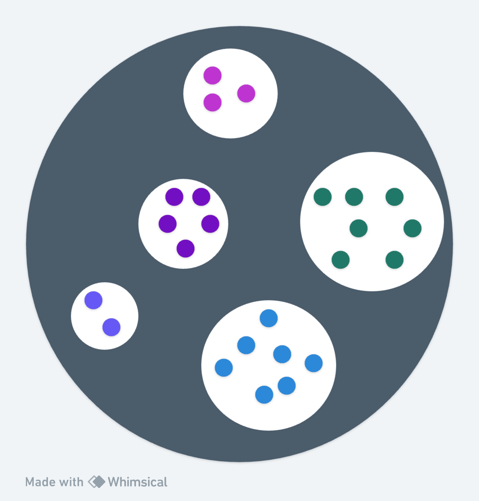

# LociNet

[The Method of Loci](https://en.wikipedia.org/wiki/Method_of_loci)

The method of loci is a strategy for memory enhancement, which uses visualizations of familiar spatial environments in order to enhance the recall of information.

"memory journey, memory palace, journey method, memory spaces, or mind palace technique"

## The Work
Developing a dynamic knowledge graph system to enhance user and machine recall and content exploration.
Utilizing ML techniques, including semantic latent space models, dimensionality reduction, embeddings and geometric graph theory to analyze relationships between user-generated media chunks and external databases to provide content and structural recommendations. Prior work: [LociMaps](https://github.com/loci-maps/mini-map).

## Ideas:

General Pipeline
1. Embed data
2. Cluster data (hierarchical) + generate labels (summaries)
3. Connect into directional graph
    

Metrics
- How well a human or AI agent can find a document based on a goal query
- Cooccurence of human vs AI tags: "Group X and Y overlap by this much in B subbranches"

Data Simplification - Tags:
- [tag]: [article it is summarizing] -> embedding
- k (20?) clusters
- assign label

